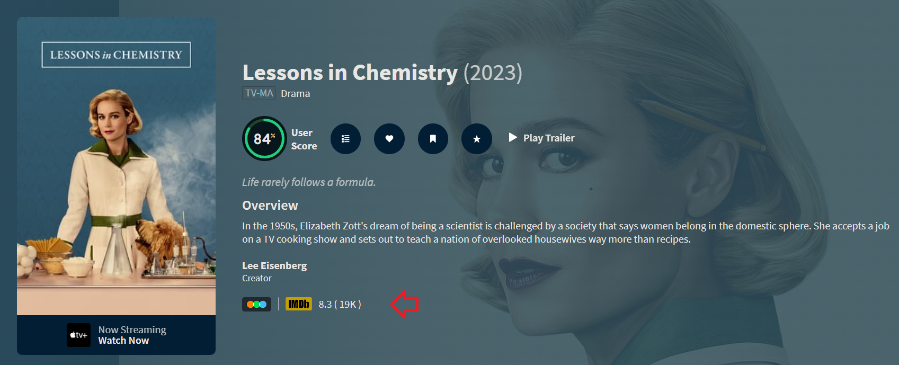
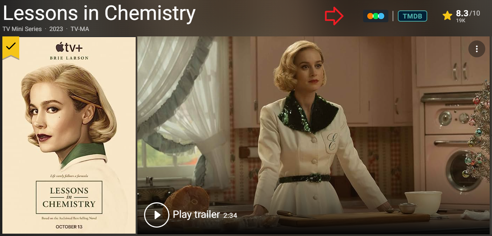

# Movie Linker extension

Opens the corresponding IMDB/TMDB/Letterboxd movie/tv show page in just one click. Also adds the ability to see IMDB ratings on TMDB pages.

# ⚠️ This extension has been converted to Tampermonkey script. This extension is no longer maintained.

## Screenshots

### TMDB page

### IMDB page

## Installation

1. Download the latest `movie-linker.zip` from [release](https://github.com/Tetrax-10/movie-linker/releases/latest) section.
2. Unzip it and save it somewhere safe so you won't delete it by accident.
3. Open `movie-linker/secrets.json` and replace the placeholder with your [TMDB API key](https://www.themoviedb.org/settings/api) (You need to login into TMDB to get an TMDB API key)
4. Then open any chromium browser and go to the extensions tab, for chrome its `chrome://extensions`.
5. Now enable developer mode and click `load unpacked` and then select `movie-linker` folder that you saved earlier.
6. Done 🥳🎉.

## Contribution

Feel free to contribute and add support for firefox browser ❤️

**Important Note:**

This extension is currently in active development, and its official version will soon be available on the Chrome Web Store. Until then, we kindly request users not to publish or distribute the extension on the Chrome Web Store or anyother platform without explicit permission. Your cooperation ensures a seamless user experience once the final version is released. Thank you for your understanding! 💕
